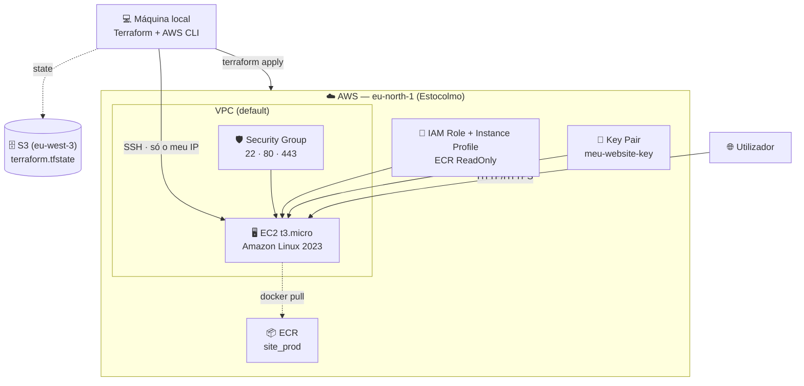
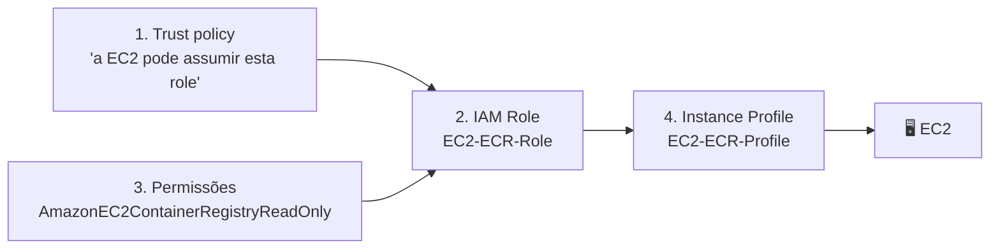
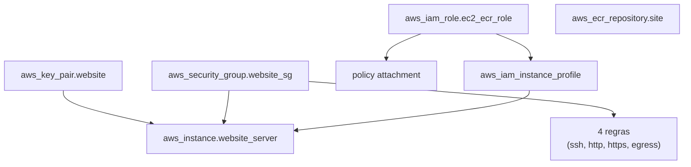
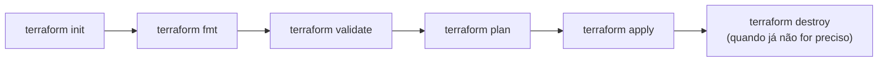

# 🏗️ Fase 2 — Infraestrutura como Código com Terraform (AWS)

Automatização, com **Terraform**, de toda a infraestrutura AWS necessária para alojar um website estático containerizado (Docker + Nginx): repositório **ECR**, permissões **IAM**, par de chaves **SSH**, **security group** e instância **EC2**, com o *state* guardado remotamente num bucket **S3**.

## 📌 Índice

1. [Resumo da Fase 1](#-resumo-da-fase-1)
2. [Objetivo da Fase 2](#-objetivo-da-fase-2)
3. [Arquitetura](#️-arquitetura)
4. [Estrutura do projeto](#-estrutura-do-projeto)
5. [Pré-requisitos](#-pré-requisitos)
6. [Conceitos de Terraform usados](#-conceitos-de-terraform-usados)
7. [Explicação de cada ficheiro](#-explicação-de-cada-ficheiro)
8. [Ordem de criação dos recursos](#-ordem-de-criação-dos-recursos)
9. [Como executar](#-como-executar)
10. [Verificação e acesso à instância](#-verificação-e-acesso-à-instância)
11. [Deploy do container](#-deploy-do-container)
12. [Limpeza](#-limpeza)
13. [Segurança e boas práticas](#-segurança-e-boas-práticas)
14. [Cuidados e problemas comuns](#-cuidados-e-problemas-comuns)
15. [Próximos passos](#-próximos-passos)

---

## 🐳 Resumo da Fase 1

Na Fase 1 tudo foi feito **manualmente**, pela consola AWS e pelo terminal:

| Passo | O que foi feito |
|---|---|
| Containerização | Website estático (HTML/CSS/JS) servido por **Nginx** dentro de um container, com um `Dockerfile` baseado em `nginx:alpine` |
| Teste local | `docker build` e `docker run` com mapeamento de porta, validado em `http://localhost` |
| ECR | Criação manual do repositório `site_prod` e envio da imagem com `docker tag` + `docker push` |
| IAM | Criação manual de uma role `EC2-ECR-Role` com a policy `AmazonEC2ContainerRegistryReadOnly` |
| EC2 | Lançamento manual de uma instância Amazon Linux 2023 com key pair e security group |
| Deploy | Ligação por SSH, instalação do Docker, `docker pull` do ECR e `docker run -p 80:80 --restart always` |

O processo funcionou, mas era **manual, demorado e difícil de repetir**. A Fase 2 resolve isso.

---

## 🎯 Objetivo da Fase 2

Descrever toda a infraestrutura em **ficheiros de código (`.tf`)**, para que possa ser:

- **Reproduzida** com um único comando (`terraform apply`) em qualquer máquina.
- **Versionada** no Git, com histórico de alterações.
- **Destruída** com um único comando (`terraform destroy`), evitando custos esquecidos.
- **Partilhada** em equipa, graças ao state remoto no S3.

Link da documentação Terraform para AWS: https://registry.terraform.io/providers/hashicorp/aws/latest/docs

---

## 🏛️ Arquitetura



---

## 📁 Estrutura do projeto

```
2ºFase - Automatizar infraestrutura com Terraform/
├── provider.tf     # provider AWS e região
├── backend.tf      # state remoto no S3
├── ecr.tf          # repositório de imagens Docker
├── ec2.tf          # key pair, EC2, security group e IAM
└── .terraform.lock.hcl   # versões do provider (gerado pelo terraform init)
```

O Terraform lê **todos os `.tf` da pasta em conjunto**, como se fossem um só. A divisão em ficheiros é apenas organizacional — a ordem dos ficheiros não afeta nada.

| Ficheiro | Responsabilidade |
|---|---|
| `provider.tf` | Diz ao Terraform que vai falar com a AWS e em que região |
| `backend.tf` | Diz ao Terraform onde guardar o *state* |
| `ecr.tf` | Cria o repositório de imagens |
| `ec2.tf` | Cria a instância e tudo o que ela precisa (chave, rede, permissões) |

---

## 🔧 Pré-requisitos

| Ferramenta | Verificar |
|---|---|
| [Terraform](https://developer.hashicorp.com/terraform/install) | `terraform --version` |
| [AWS CLI](https://docs.aws.amazon.com/cli/latest/userguide/getting-started-install.html) configurado (`aws configure`) | `aws sts get-caller-identity` |
| `ssh-keygen` (incluído no OpenSSH) | `ssh-keygen -h` |
| Docker (para construir e enviar a imagem) | `docker --version` |
| Bucket S3 para o state, **criado previamente** | ver [backend.tf](#backendtf) |

O Terraform usa as **mesmas credenciais do AWS CLI** (`~/.aws/credentials`), não precisa de configuração adicional.

---

## 📖 Conceitos de Terraform usados

| Conceito | O que é | Exemplo neste projeto |
|---|---|---|
| **provider** | Plugin que permite ao Terraform gerir um serviço (AWS, Azure, ...) | `provider "aws"` |
| **resource** | Um recurso real que o Terraform cria e gere | `aws_instance`, `aws_ecr_repository` |
| **data source** | Lê ou calcula informação, **sem criar nada** | `data "aws_iam_policy_document"` |
| **referência** | Usar um atributo de outro recurso; cria uma dependência automática | `aws_security_group.website_sg.id` |
| **state** | Ficheiro onde o Terraform regista o que já criou | `terraform.tfstate` |
| **backend** | Sítio onde o state é guardado | S3 |
| **plan** | Simulação: mostra o que vai mudar, sem executar | `terraform plan` |
| **apply** | Executa as alterações | `terraform apply` |

**Sintaxe de um recurso:**

```hcl
resource "TIPO" "NOME_LOCAL" {
  argumento = "valor"
}
```

- `TIPO` — definido pelo provider (ex.: `aws_instance`).
- `NOME_LOCAL` — nome que escolhes, usado só dentro do código para referenciar o recurso (ex.: `website_server`).
- Para referenciar: `TIPO.NOME_LOCAL.atributo` (ex.: `aws_key_pair.website.key_name`).

---

## 📄 Explicação de cada ficheiro

### `provider.tf`

```hcl
provider "aws" {
  region = "eu-north-1"
}
```

| Linha | O que faz |
|---|---|
| `provider "aws"` | Declara que o Terraform vai usar o provider da AWS (`hashicorp/aws`) |
| `region = "eu-north-1"` | Todos os recursos são criados em **Estocolmo**, exceto se um recurso indicar outra região |

No `terraform init`, o Terraform descarrega o provider (neste projeto, `hashicorp/aws v6.66.0`) e regista a versão no ficheiro `.terraform.lock.hcl`, que **deve ser commitado** para garantir as mesmas versões em qualquer máquina.

---

### `backend.tf`

```hcl
terraform {
  backend "s3" {
    bucket  = "terraform-state-luisazevedo"
    key     = "site/terraform.tfstate"
    region  = "eu-west-3"
    encrypt = true
  }
}
```

| Argumento | O que faz |
|---|---|
| `backend "s3"` | Em vez de guardar o state num ficheiro local, guarda-o num bucket S3 |
| `bucket` | Nome do bucket S3 onde o state fica |
| `key` | Caminho do ficheiro dentro do bucket (`site/terraform.tfstate`), permite ter vários projetos no mesmo bucket |
| `region` | Região **do bucket** (Paris). Pode ser diferente da região dos recursos (`eu-north-1`) |
| `encrypt = true` | Encripta o ficheiro de state em repouso |

**Porquê usar state remoto?**

- O state é a "memória" do Terraform: sabe o que já existe e o que falta criar. Se se perder, o Terraform deixa de saber quais são os seus recursos.
- Guardado no S3, permite **trabalhar em equipa** e **não depender de uma só máquina**.
- O state pode conter **dados sensíveis**, por isso deve estar encriptado e o bucket privado.

**Pontos importantes:**

- ⚠️ O bucket **tem de existir antes** do `terraform init`. O Terraform não o cria (é impossível guardar no state a criação do próprio bucket do state).
- ⚠️ O backend S3 só **partilha** o state. Para impedir dois `apply` em simultâneo é preciso ativar *locking* (nas versões recentes do Terraform, com `use_lockfile = true` neste bloco).
- Ao mudar o backend, é preciso repetir `terraform init`.

---

### `ecr.tf`

```hcl
resource "aws_ecr_repository" "site" {
  name                 = "site_prod"
  image_tag_mutability = "MUTABLE"

  image_scanning_configuration {
    scan_on_push = false
  }
}
```

| Argumento | O que faz |
|---|---|
| `aws_ecr_repository` | Cria um repositório no **Amazon ECR** (o "Docker Hub privado" da AWS) |
| `"site"` | Nome local para referenciar no código (`aws_ecr_repository.site`) |
| `name = "site_prod"` | Nome real do repositório na AWS |
| `image_tag_mutability = "MUTABLE"` | Permite **reutilizar uma tag** (ex.: voltar a enviar `v1.0`). Com `IMMUTABLE`, cada tag só podia ser usada uma vez |
| `scan_on_push = false` | Não faz análise automática de vulnerabilidades a cada `docker push` (pode ativar-se com `true`) |

O repositório é criado **vazio**: a imagem tem de ser enviada depois com `docker push` (ver [Deploy do container](#-deploy-do-container)).

---

### `ec2.tf`

Este ficheiro tem cinco blocos lógicos: **key pair**, **EC2**, **security group**, **regras do security group** e **IAM**.

#### 1️⃣ Key pair — acesso por SSH

Primeiro, gera-se o par de chaves **no computador local** (fora do Terraform):

```bash
ssh-keygen -t ed25519 -f ~/.ssh/meu-website-key -C "meu-website"
```

| Parte do comando | Significado |
|---|---|
| `-t ed25519` | Algoritmo da chave (moderno, seguro e curto) |
| `-f ~/.ssh/meu-website-key` | Onde guardar o par de chaves |
| `-C "meu-website"` | Comentário/etiqueta para identificar a chave |

Isto cria dois ficheiros:

- `meu-website-key` → **chave privada** (nunca sai do computador, nunca vai para o Git)
- `meu-website-key.pub` → **chave pública** (é esta que se envia para a AWS)

```hcl
resource "aws_key_pair" "website" {
  key_name   = "meu-website-key"
  public_key = file("~/.ssh/meu-website-key.pub")
}
```

| Argumento | O que faz |
|---|---|
| `aws_key_pair` | Regista uma chave pública na AWS (EC2 → Key Pairs) |
| `key_name` | Nome da chave na AWS; é este nome que a EC2 vai referenciar |
| `public_key = file(...)` | A função `file()` **lê o conteúdo** do ficheiro `.pub` local e envia-o para a AWS |

A AWS instala esta chave pública na instância; quem tiver a chave privada correspondente consegue entrar.

#### 2️⃣ Instância EC2

```hcl
resource "aws_instance" "website_server" {
  ami                    = "ami-06cfeaaa22092f09d"
  key_name               = aws_key_pair.website.key_name
  instance_type          = "t3.micro"
  vpc_security_group_ids = [aws_security_group.website_sg.id]
  iam_instance_profile   = aws_iam_instance_profile.ec2_ecr_profile.name

  tags = {
    Name        = "ec2_website"
    Provisioned = "Terraform"
    Cliente     = "Luis"
  }
}
```

| Argumento | O que faz |
|---|---|
| `aws_instance` | Cria uma máquina virtual EC2 |
| `ami` | Imagem base da máquina: **Amazon Linux 2023**. ⚠️ Os IDs de AMI são **específicos de cada região** — este só funciona em `eu-north-1` |
| `key_name = aws_key_pair.website.key_name` | Associa a chave SSH criada acima. Por ser uma **referência**, o Terraform sabe que tem de criar a key pair primeiro |
| `instance_type = "t3.micro"` | Tamanho da máquina (2 vCPU, 1 GiB de RAM) — o mais pequeno, adequado a um site estático |
| `vpc_security_group_ids` | Lista de security groups (firewall) associados. Note-se que é uma **lista** (`[...]`) |
| `iam_instance_profile` | Liga o **instance profile** com as permissões IAM (acesso ao ECR) |
| `tags` | Etiquetas para identificar o recurso. `Name` aparece como nome na consola; `Provisioned = "Terraform"` marca que foi criado por código |

Como não foi indicado `subnet_id`, a instância é lançada numa **subnet da VPC default**, que atribui automaticamente um **IP público**.

#### 3️⃣ Security group

```hcl
resource "aws_security_group" "website_sg" {
  name        = "security group do site"
  description = "create security group"
  vpc_id      = "vpc-xxxxxxxxxxxxxxxxx"

  tags = {
    Name        = "website-sg"
    Provisioned = "Terraform"
    Cliente     = "Luis"
  }
}
```

| Argumento | O que faz |
|---|---|
| `aws_security_group` | Cria uma **firewall virtual** ao nível da instância |
| `name` / `description` | Nome e descrição do grupo na AWS |
| `vpc_id` | VPC onde o grupo é criado. **Tem de ser a mesma VPC da subnet onde a EC2 vai ficar** (aqui, a VPC default de `eu-north-1`) |

Este bloco cria apenas o "contentor" do grupo, **vazio**. As regras são criadas em recursos separados (abaixo).

#### 4️⃣ Regras do security group

Cada regra é um recurso independente, ligado ao grupo através de `security_group_id`. Esta é a forma atual recomendada pela AWS/Terraform (em vez de blocos `ingress`/`egress` dentro do grupo), porque cada regra pode ser criada, alterada e removida sem afetar as outras.

```hcl
# SSH — apenas do meu IP
resource "aws_vpc_security_group_ingress_rule" "allow_ssh" {
  security_group_id = aws_security_group.website_sg.id
  cidr_ipv4         = "<O_TEU_IP>/32"
  from_port         = 22
  ip_protocol       = "tcp"
  to_port           = 22
}

# HTTP — qualquer origem
resource "aws_vpc_security_group_ingress_rule" "allow_http" {
  security_group_id = aws_security_group.website_sg.id
  cidr_ipv4         = "0.0.0.0/0"
  from_port         = 80
  ip_protocol       = "tcp"
  to_port           = 80
}

# HTTPS — qualquer origem
resource "aws_vpc_security_group_ingress_rule" "allow_https" {
  security_group_id = aws_security_group.website_sg.id
  cidr_ipv4         = "0.0.0.0/0"
  from_port         = 443
  ip_protocol       = "tcp"
  to_port           = 443
}

# Saída — a EC2 pode aceder à internet
resource "aws_vpc_security_group_egress_rule" "allow_internet" {
  security_group_id = aws_security_group.website_sg.id
  cidr_ipv4         = "0.0.0.0/0"
  ip_protocol       = "-1"
}
```

| Argumento | Significado |
|---|---|
| `ingress_rule` / `egress_rule` | Regra de **entrada** (tráfego que chega à EC2) / de **saída** (tráfego que sai da EC2) |
| `security_group_id` | A que grupo pertence a regra (referência ao grupo criado acima) |
| `cidr_ipv4` | Origem (entrada) ou destino (saída) permitido, em formato CIDR |
| `from_port` / `to_port` | Intervalo de portas (aqui, uma só porta) |
| `ip_protocol` | Protocolo: `tcp`, `udp`, `icmp` ou `-1` (todos) |

**Leitura de cada regra:**

| Regra | Porta | Origem/Destino | Porquê |
|---|---|---|---|
| `allow_ssh` | 22 | `<O_TEU_IP>/32` | Só o meu IP pode administrar a máquina. `/32` significa **exatamente um IP** |
| `allow_http` | 80 | `0.0.0.0/0` | Qualquer pessoa na internet pode ver o site. `/0` significa **todos os IPs** |
| `allow_https` | 443 | `0.0.0.0/0` | Idem, para HTTPS |
| `allow_internet` | todas (`-1`) | `0.0.0.0/0` | A EC2 precisa de sair para a internet: instalar Docker, atualizar o sistema, fazer `docker pull` do ECR |

> 💡 **Porque é que a regra de saída é obrigatória?** Ao contrário da consola, quando o Terraform cria um security group **remove a regra de saída por defeito**. Sem `allow_internet`, a EC2 não consegue instalar pacotes nem aceder ao ECR.

> ⚠️ Nota sobre o HTTPS: a regra da porta 443 está aberta, mas o container Nginx desta fase só serve HTTP na porta 80. Para HTTPS de facto seria necessário um certificado (ex.: ACM + load balancer, ou Certbot).

#### 5️⃣ IAM — permitir que a EC2 aceda ao ECR

Para a EC2 fazer `docker pull` do ECR **sem guardar credenciais na máquina**, usa-se uma **IAM Role** ligada à instância. São necessárias quatro peças:

```hcl
# 1) Trust policy: QUEM pode assumir a role
data "aws_iam_policy_document" "ec2_assume_role" {
  statement {
    effect  = "Allow"
    actions = ["sts:AssumeRole"]

    principals {
      type        = "Service"
      identifiers = ["ec2.amazonaws.com"]
    }
  }
}

# 2) A role
resource "aws_iam_role" "ec2_ecr_role" {
  name               = "EC2-ECR-Role"
  assume_role_policy = data.aws_iam_policy_document.ec2_assume_role.json
}

# 3) Permissões: policy gerida pela AWS
resource "aws_iam_role_policy_attachment" "ecr_read_only" {
  role       = aws_iam_role.ec2_ecr_role.name
  policy_arn = "arn:aws:iam::aws:policy/AmazonEC2ContainerRegistryReadOnly"
}

# 4) Instance profile: o que efetivamente se liga à EC2
resource "aws_iam_instance_profile" "ec2_ecr_profile" {
  name = "EC2-ECR-Profile"
  role = aws_iam_role.ec2_ecr_role.name
}
```



| Peça | O que faz |
|---|---|
| **1. `data "aws_iam_policy_document"`** | *Data source*: não cria nada, apenas **gera o JSON** da trust policy. Diz que o serviço `ec2.amazonaws.com` tem permissão (`sts:AssumeRole`) para "vestir" esta role |
| **2. `aws_iam_role`** | Cria a role. `assume_role_policy` recebe o JSON gerado em (1) através de `.json` |
| **3. `aws_iam_role_policy_attachment`** | Anexa à role a policy **gerida pela AWS** `AmazonEC2ContainerRegistryReadOnly`, que permite apenas **ler/descarregar** do ECR (não escrever nem apagar) |
| **4. `aws_iam_instance_profile`** | É o "invólucro" que permite ligar uma role a uma EC2. É este que é referenciado no `aws_instance` |

**Duas policies diferentes, dois papéis:**

- **Trust policy** → *quem* pode usar a role (a EC2).
- **Permissions policy** → *o que* essa role pode fazer (ler do ECR).

> 💡 **Porque é que existe o instance profile?** Na consola AWS é criado automaticamente quando se cria uma role para EC2. No Terraform tem de ser declarado à mão, e a EC2 usa o **profile**, não a role diretamente. Sem ele, a instância arranca sem permissões e o `docker pull` falha por falta de autenticação.

**Princípio do menor privilégio:** a role só tem permissão de **leitura** no ECR — suficiente para o deploy e sem risco de a EC2 alterar ou apagar imagens.

---

## 🔗 Ordem de criação dos recursos

Não é preciso dizer ao Terraform por que ordem criar as coisas. Ele analisa as **referências** entre recursos e constrói sozinho um grafo de dependências:



Recursos **sem dependência entre si** são criados **em paralelo**. Foi o que aconteceu no `apply` deste projeto:

1. Em paralelo: key pair, IAM role, repositório ECR e security group
2. Depois: policy attachment, instance profile e as 4 regras do security group
3. Por fim: a **EC2** (só arranca depois de a key pair, o security group e o instance profile existirem)

---

## ▶️ Como executar



### 1. Preparar

```bash
# gerar a chave SSH (só uma vez)
ssh-keygen -t ed25519 -f ~/.ssh/meu-website-key -C "meu-website"
```

O bucket S3 do state tem de existir previamente.

### 2. Comandos Terraform

| Comando | O que faz |
|---|---|
| `terraform init` | Liga ao backend S3 e descarrega o provider AWS. Cria `.terraform/` e `.terraform.lock.hcl` |
| `terraform fmt` | Formata automaticamente os `.tf` (indentação, alinhamento). Devolve o nome dos ficheiros que alterou |
| `terraform validate` | Verifica a sintaxe e a consistência da configuração (não contacta a AWS) |
| `terraform plan` | Compara o código com o state e mostra o que **vai** acontecer, sem mudar nada |
| `terraform apply` | Executa o plano. Mostra-o novamente e pede confirmação (`yes`) |
| `terraform destroy` | Destrói todos os recursos geridos pelo Terraform |

### 3. Resultados obtidos neste projeto

**`terraform init`**

```
Successfully configured the backend "s3"!
- Installing hashicorp/aws v6.66.0...
Terraform has been successfully initialized!
```

**`terraform validate`**

```
Success! The configuration is valid.
```

**`terraform plan`** — símbolo `+` significa "vai ser criado":

```
Plan: 11 to add, 0 to change, 0 to destroy.
```

**`terraform apply`**

```
Apply complete! Resources: 11 added, 0 changed, 0 destroyed.
```

### 4. Os 11 recursos criados

| # | Recurso | Nome |
|---|---|---|
| 1 | `aws_ecr_repository` | `site_prod` |
| 2 | `aws_key_pair` | `meu-website-key` |
| 3 | `aws_iam_role` | `EC2-ECR-Role` |
| 4 | `aws_iam_role_policy_attachment` | ECR ReadOnly |
| 5 | `aws_iam_instance_profile` | `EC2-ECR-Profile` |
| 6 | `aws_security_group` | `website_sg` |
| 7 | `aws_vpc_security_group_ingress_rule` | `allow_ssh` |
| 8 | `aws_vpc_security_group_ingress_rule` | `allow_http` |
| 9 | `aws_vpc_security_group_ingress_rule` | `allow_https` |
| 10 | `aws_vpc_security_group_egress_rule` | `allow_internet` |
| 11 | `aws_instance` | `website_server` |

---

## ✅ Verificação e acesso à instância

O IP público da EC2 está na consola AWS (EC2 → Instances) ou obtém-se com:

```bash
aws ec2 describe-instances --region eu-north-1 \
  --filters "Name=tag:Name,Values=ec2_website" \
  --query "Reservations[].Instances[].PublicIpAddress" --output text
```

Ligar por SSH, usando a chave **privada** (sem `.pub`):

```bash
ssh -i ~/.ssh/meu-website-key ec2-user@<IP_PUBLICO_EC2>
```

Na primeira ligação o SSH pede para confirmar a identidade do servidor (*fingerprint*) — responder `yes`. Se aparecer o banner **Amazon Linux 2023**, o Terraform fez o seu trabalho: chave, security group e instância estão a funcionar.

Dentro da instância, `sudo yum update -y` respondeu `Nothing to do`, o que confirma que a AMI já vinha atualizada e que a **regra de saída** para a internet funciona.

---

## 🐳 Deploy do container

### Enviar a imagem para o ECR (na máquina local)

O repositório criado pelo Terraform está **vazio**, por isso a imagem tem de ser enviada primeiro:

```bash
# autenticar o Docker no ECR
aws ecr get-login-password --region eu-north-1 \
  | docker login --username AWS --password-stdin <CONTA_AWS>.dkr.ecr.eu-north-1.amazonaws.com

# etiquetar a imagem com o URI do repositório
docker tag meu-website:v1.0 <CONTA_AWS>.dkr.ecr.eu-north-1.amazonaws.com/site_prod:v1.0

# enviar
docker push <CONTA_AWS>.dkr.ecr.eu-north-1.amazonaws.com/site_prod:v1.0
```

### Correr o container (na EC2)

```bash
# instalar e ativar o Docker
sudo yum install docker -y
sudo systemctl start docker
sudo systemctl enable docker
sudo usermod -a -G docker ec2-user
exit    # sair e voltar a entrar, para o grupo "docker" ter efeito
```

Depois de voltar a entrar por SSH:

```bash
# autenticar no ECR (usa as credenciais da IAM Role, sem aws configure)
aws ecr get-login-password --region eu-north-1 \
  | docker login --username AWS --password-stdin <CONTA_AWS>.dkr.ecr.eu-north-1.amazonaws.com

docker pull <CONTA_AWS>.dkr.ecr.eu-north-1.amazonaws.com/site_prod:v1.0

docker run -d -p 80:80 --name meu-website-prod --restart always \
  <CONTA_AWS>.dkr.ecr.eu-north-1.amazonaws.com/site_prod:v1.0

docker ps
```

| Parâmetro | Função |
|---|---|
| `-d` | Corre em background |
| `-p 80:80` | Porta 80 da EC2 → porta 80 do container |
| `--restart always` | O container volta a arrancar se a EC2 reiniciar |

Testar no browser: `http://<IP_PUBLICO_EC2>`

> 💡 O `aws ecr get-login-password` funciona **sem `aws configure`** na EC2: as credenciais temporárias vêm da IAM Role ligada à instância. É exatamente para isto que serve o bloco IAM do `ec2.tf`.

---

## 🧹 Limpeza

```bash
terraform destroy
```

Destrói os 11 recursos e evita custos. Pontos a ter em conta:

- Se o repositório ECR tiver **imagens**, o `destroy` falha, a não ser que o recurso tenha `force_delete = true` (ou que o repositório seja esvaziado primeiro).
- O **bucket S3 do state não é destruído**, porque foi criado fora do Terraform. Apaga-o manualmente se já não for preciso.
- A **chave privada local** (`~/.ssh/meu-website-key`) não é apagada; só a chave pública registada na AWS.

---

## 🔒 Segurança e boas práticas

`.gitignore` recomendado:


| Prática | Detalhe |
|---|---|
| Commitar `.terraform.lock.hcl` | Garante as mesmas versões do provider em qualquer máquina |
| Nunca commitar chaves privadas | A chave `meu-website-key` fica só no computador |
| Não commitar state local nem credenciais | O state pode conter dados sensíveis |
| SSH restrito ao meu IP | Só as portas 80 e 443 estão abertas ao mundo |
| Menor privilégio no IAM | A role só pode ler do ECR |
| State encriptado no S3 | `encrypt = true` |
| Tags em todos os recursos | `Provisioned = "Terraform"` distingue o que foi criado por código |

---

## ⚠️ Cuidados e problemas comuns

| Situação | Causa | Solução |
|---|---|---|
| Erro de "already exists" no `apply` | Recursos da Fase 1 (feitos à mão) com o mesmo nome: `site_prod`, `EC2-ECR-Role`, `meu-website-key` | Apagar os recursos manuais antes, ou importá-los com `terraform import` |
| `terraform init` falha no backend | O bucket S3 não existe, ou a região em `backend.tf` não é a do bucket | Criar o bucket e confirmar a região |
| Erro na AMI | Os IDs de AMI são específicos de cada região | Usar uma AMI de `eu-north-1` |
| Erro de VPC / security group | O `vpc_id` não é da mesma região ou VPC da subnet da EC2 | Confirmar o ID da VPC default da região |
| Deixei de conseguir fazer SSH | O IP público de casa mudou e a regra `allow_ssh` continua com o antigo | Atualizar o `cidr_ipv4` e correr `terraform apply` |
| `docker pull` falha na EC2 (sem permissão) | Instance profile não associado à instância | Confirmar `iam_instance_profile` no `aws_instance` |
| `docker pull` não encontra a imagem | Repositório vazio | Fazer `docker push` a partir da máquina local |
| `permission denied` nos comandos `docker` | Sessão anterior ao `usermod -aG docker` | Sair e voltar a entrar por SSH |
| `destroy` falha no ECR | O repositório tem imagens | `force_delete = true` ou esvaziar o repositório |

---

