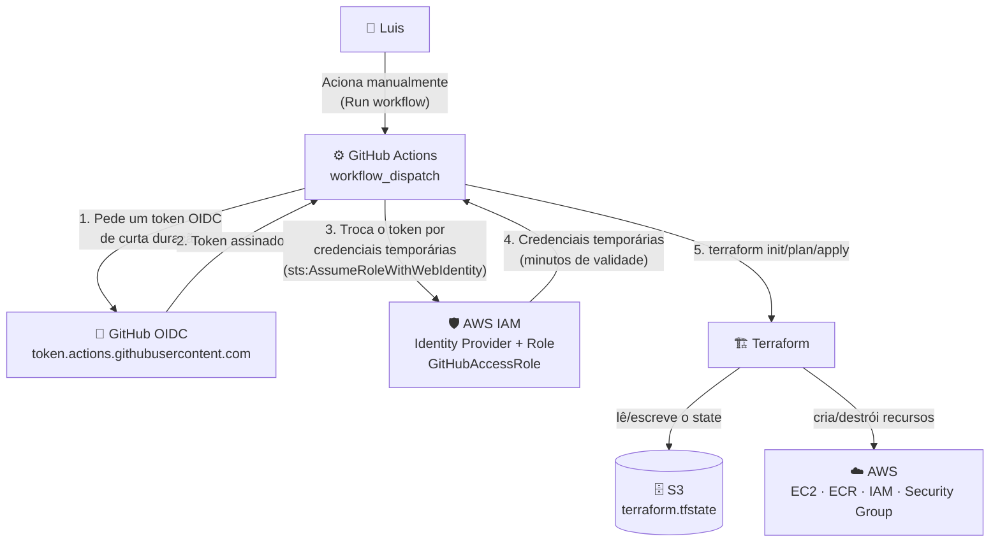
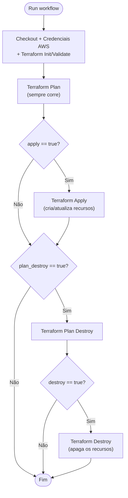

# 🔄 Fase 3 — Pipeline CI/CD com GitHub Actions + Terraform

Automatização do processo de `terraform plan`/`apply`/`destroy`, que antes era corrido manualmente no terminal (Fase 2), através de um **pipeline no GitHub Actions**. A ligação entre o GitHub e a AWS é feita sem chaves de acesso fixas, usando **OIDC** (OpenID Connect).

## 📌 Índice

1. [Resumo das fases anteriores](#-resumo-das-fases-anteriores)
2. [Objetivo da Fase 3](#-objetivo-da-fase-3)
3. [Arquitetura do pipeline](#️-arquitetura-do-pipeline)
4. [Porque usar OIDC em vez de Access Keys](#-porque-usar-oidc-em-vez-de-access-keys)
5. [Configuração na AWS](#-configuração-na-aws)
6. [O workflow, bloco a bloco](#-o-workflow-bloco-a-bloco)
7. [Como executar o pipeline](#-como-executar-o-pipeline)
8. [Fluxo de decisão do pipeline](#-fluxo-de-decisão-do-pipeline)
9. [Problemas encontrados e soluções](#-problemas-encontrados-e-soluções)
10. [Estrutura de ficheiros no repositório](#-estrutura-de-ficheiros-no-repositório)
11. [Segurança e boas práticas](#-segurança-e-boas-práticas)
12. [Próximos passos](#-próximos-passos)

---

## 🐳 Resumo das fases anteriores

| Fase | O que foi feito |
|---|---|
| **1 — Docker + deploy manual** | Website estático containerizado com Nginx; imagem publicada manualmente no ECR; EC2 lançada e configurada à mão pela consola AWS |
| **2 — Terraform** | Toda essa infraestrutura (ECR, IAM Role, key pair, security group, EC2) passou a estar descrita em código (`provider.tf`, `backend.tf`, `ecr.tf`, `ec2.tf`), com o *state* guardado remotamente num bucket S3 |
| **3 — Pipeline CI/CD** *(esta fase)* | O `terraform plan`/`apply`/`destroy`, que na Fase 2 era corrido manualmente no terminal, passa a ser executado automaticamente por um **workflow do GitHub Actions**, acionado a partir do próprio GitHub |

---

## 🎯 Objetivo da Fase 3

- Deixar de correr `terraform apply` manualmente no computador local.
- Ter um **histórico** de todas as execuções (quem correu, quando, o que mudou).
- Não guardar credenciais AWS permanentes em lado nenhum — nem no computador, nem no GitHub.
- Ter **controlo explícito** sobre ações destrutivas (`destroy`), para nunca acontecerem sem intenção clara.

---

## 🏛️ Arquitetura do pipeline



**A ideia central:** o GitHub nunca guarda uma chave AWS permanente. Em cada execução, prova à AWS "sou mesmo o repositório `LuisAzevedoGit/Projetos`" através de um token assinado (OIDC), e a AWS troca esse token por credenciais **temporárias**, válidas só durante a execução do workflow.

---

## 🔑 Porque usar OIDC em vez de Access Keys

| | **Access Keys (Secrets)** | **OIDC (usado neste projeto)** |
|---|---|---|
| O que se guarda no GitHub | `AWS_ACCESS_KEY_ID` + `AWS_SECRET_ACCESS_KEY`, fixos | Nada — nenhuma credencial permanente |
| Validade das credenciais | Permanente, até seres tu a revogar | Minutos — geradas a cada execução |
| Risco se vazarem | Alto — a chave continua válida até a apagares manualmente | Baixo — o token expira sozinho, e só funciona vindo do teu repositório específico |
| Quem pode usar | Quem tiver a chave, de qualquer sítio | Só workflows do repositório/organização configurados na *trust policy* |
| Manutenção | É preciso rodar as chaves manualmente de vez em quando | Nada a rodar — não há segredo fixo para gerir |

> 💡 Esta é atualmente a forma **recomendada pela própria AWS e GitHub** de ligar pipelines de CI/CD à AWS — é por isto que a `permissions: id-token: write` aparece no workflow.

---

## ⚙️ Configuração na AWS

Antes do workflow funcionar, foi preciso preparar duas coisas do lado da AWS: um **Identity Provider** e uma **IAM Role** que confia nesse provider.

### 1. Criar o Identity Provider (OIDC)

No **IAM Console → Identity providers → Add provider**:

| Campo | Valor |
|---|---|
| Provider type | OpenID Connect |
| Provider URL | `https://token.actions.githubusercontent.com` |
| Audience | `sts.amazonaws.com` |

Isto diz à AWS: *"passo a confiar em tokens assinados pelo GitHub Actions."* Sem isto, o passo seguinte (a role) nem sequer teria a quem confiar.

### 2. Criar a Role e a Trust Policy

Ao criar a role (**IAM → Roles → Create role**), a entidade de confiança escolhida foi **Web identity**, apontando para o Identity Provider criado no passo anterior:

| Campo | Valor | Função |
|---|---|---|
| Identity provider | `token.actions.githubusercontent.com` | O provider criado no passo 1 |
| Audience | `sts.amazonaws.com` | Tem de corresponder ao Audience do provider |
| GitHub organization | `LuisAzevedoGit` | Só workflows **desta conta/organização** GitHub podem assumir a role |
| GitHub repository | `Projetos` | Restringe ainda mais: só workflows **deste repositório** |
| GitHub branch | `*` (qualquer) | Não restringe por branch — qualquer branch deste repo pode assumir a role |

Isto gera automaticamente uma **trust policy** (política de confiança) parecida com esta:

```json
{
  "Version": "2012-10-17",
  "Statement": [
    {
      "Effect": "Allow",
      "Principal": {
        "Federated": "arn:aws:iam::<CONTA_AWS>:oidc-provider/token.actions.githubusercontent.com"
      },
      "Action": "sts:AssumeRoleWithWebIdentity",
      "Condition": {
        "StringEquals": {
          "token.actions.githubusercontent.com:aud": "sts.amazonaws.com"
        },
        "StringLike": {
          "token.actions.githubusercontent.com:sub": "repo:LuisAzevedoGit/Projetos:*"
        }
      }
    }
  ]
}
```

> 🔒 A condição `token.actions.githubusercontent.com:sub` é a peça-chave de segurança: só um token que diga literalmente "eu sou uma execução do repositório `LuisAzevedoGit/Projetos`" é aceite. Um workflow de outro repositório, mesmo que também use GitHub Actions, seria **recusado**.

### 3. Permissões anexadas à role (`GitHubAccessRole`)

| Policy | Tipo | Porque é necessária |
|---|---|---|
| `AmazonEC2FullAccess` | AWS managed | Criar/gerir EC2, security groups, key pairs |
| `AmazonEC2ContainerRegistryFullAccess` | AWS managed | Criar/gerir o repositório ECR |
| `AmazonS3FullAccess` | AWS managed | Ler e escrever o ficheiro de state do Terraform no bucket S3 |
| `IAMFullAccess` | AWS managed | Criar a `EC2-ECR-Role` e o instance profile que a EC2 usa para aceder ao ECR |

> ⚠️ **Nota de segurança:** usar as versões `FullAccess` foi a forma mais rápida de desbloquear o pipeline, mas dá à role mais poder do que ela precisa (ex.: `AmazonS3FullAccess` permite mexer em **qualquer** bucket da conta, não só no do state). Numa fase seguinte, o ideal é substituir estas quatro por uma **policy inline restrita**, que só permita as ações e os recursos exatos que o `ec2.tf`/`ecr.tf` usam (ver [Próximos passos](#-próximos-passos)).

---

## 📄 O workflow, bloco a bloco

Ficheiro: `.github/workflows/terraform.yaml`

### Cabeçalho e trigger

```yaml
name: Terraform CI/CD

on:
  workflow_dispatch:
    inputs:
      apply:
        description: 'Executar o terraform apply'
        required: true
        default: 'false'
        type: choice
        options:
          - true
          - false
      plan_destroy:
        description: 'planear o terraform destroy'
        ...
      destroy:
        description: 'Executar o terraform destroy'
        ...
```

| Elemento | O que faz |
|---|---|
| `on: workflow_dispatch` | O workflow **não** corre automaticamente em cada `push`. Só corre quando é acionado manualmente, no separador **Actions** do GitHub |
| `inputs: apply / plan_destroy / destroy` | Três "interruptores" (`true`/`false`) que aparecem como campos no formulário do GitHub, antes de correr o workflow. Controlam que ações vão realmente acontecer |

> 💡 Ter três inputs separados (em vez de um único "modo") dá controlo fino: por defeito, um `plan` normal corre sempre; só se ativares `apply` é que algo é criado, e só se ativares `destroy` (com o `plan_destroy` a validar o plano) é que algo é destruído.

### Permissões do job

```yaml
permissions:
  contents: read
  id-token: write
```

| Permissão | Porquê |
|---|---|
| `contents: read` | O workflow só precisa de **ler** o código do repositório (fazer checkout), não de o alterar |
| `id-token: write` | **A permissão-chave para o OIDC.** Permite ao workflow pedir um token de identidade assinado pelo GitHub. Sem esta linha, o passo `configure-aws-credentials` falha, porque não há token para trocar por credenciais AWS |

### Job e steps iniciais

```yaml
jobs:
  job1:
    name: Terraform
    runs-on: ubuntu-latest
    steps:
      - name: Checkout
        uses: actions/checkout@v4

      - name: Setup AWS Credentials
        uses: aws-actions/configure-aws-credentials@v2
        with:
          role-to-assume: arn:aws:iam::367332297990:role/GitHubAccessRole
          aws-region: eu-north-1

      - name: HashiCorp - Setup Terraform
        uses: hashicorp/setup-terraform@v4.0.1
```

| Step | O que faz |
|---|---|
| `runs-on: ubuntu-latest` | A execução acontece numa máquina virtual **temporária** da GitHub (um "runner"), com Ubuntu, que existe só durante esta execução |
| `Checkout` (`actions/checkout@v4`) | Copia o conteúdo do repositório para dentro do runner — sem isto, não haveria ficheiros `.tf` para o Terraform ler |
| `Setup AWS Credentials` | É aqui que acontece a troca OIDC → credenciais AWS temporárias, explicada no diagrama de arquitetura. `role-to-assume` é o ARN exato da role criada na secção anterior |
| `Setup Terraform` | Instala o binário do Terraform (versão fixada por esta action) no runner, para os comandos `terraform ...` seguintes funcionarem |

### Steps do Terraform

```yaml
      - name: Terraform Init
        working-directory: 6-Projeto Pratico/3ºFase- Pipeline de infraestrutura
        run: terraform init

      - name: Terraform Validate
        working-directory: 6-Projeto Pratico/3ºFase- Pipeline de infraestrutura
        run: terraform validate

      - name: Terraform Plan
        working-directory: 6-Projeto Pratico/3ºFase- Pipeline de infraestrutura
        run: terraform plan -out=tfplan.tfout

      - name: Terraform Apply
        working-directory: 6-Projeto Pratico/3ºFase- Pipeline de infraestrutura
        if: ${{ github.event.inputs.apply == 'true' }}
        run: terraform apply -auto-approve tfplan.tfout
```

| Step | O que faz |
|---|---|
| `working-directory` | Como o `.github/workflows/` está na **raiz** do repositório, mas os `.tf` estão numa subpasta, é preciso dizer ao GitHub Actions onde correr cada comando. Repetido em todos os steps do Terraform |
| `Terraform Init` |  liga ao backend S3 (lê/escreve o `terraform.tfstate` remoto) e descarrega o provider `hashicorp/aws` para dentro do runner |
| `Terraform Validate` | Confirma que a sintaxe dos ficheiros `.tf` está correta|
| `Terraform Plan` | Compara o código com o state atual e grava o resultado no ficheiro `tfplan.tfout`. Este step **corre sempre**, independentemente dos inputs — serve para veres sempre o que mudaria, mesmo sem aplicar |
| `Terraform Apply` | Só corre **se** o input `apply` for `'true'`. Aplica exatamente o plano gravado em `tfplan.tfout` — não gera um novo plano, usa o que já foi calculado no step anterior |

> ⚠️ Nota: `if: ${{ github.event.inputs.apply == 'true' }}` compara com a **string** `'true'`, não com um booleano — os inputs de `workflow_dispatch` chegam sempre como texto, por isso as aspas nos `options` do input são importantes.

### Steps de destroy

```yaml
      - name: Terraform plan destroy
        working-directory: 6-Projeto Pratico/3ºFase- Pipeline de infraestrutura
        if: ${{ github.event.inputs.plan_destroy == 'true' }}
        run: terraform plan -destroy -out=tfplandestroy

      - name: Terraform destroy
        working-directory: 6-Projeto Pratico/3ºFase- Pipeline de infraestrutura
        if: ${{ github.event.inputs.destroy == 'true' }}
        run: terraform apply -auto-approve tfplandestroy
```

| Step | O que faz |
|---|---|
| `Terraform plan destroy` | Só corre se `plan_destroy = true`. `terraform plan -destroy` calcula o que seria **destruído**, e grava esse plano num ficheiro **separado** (`tfplandestroy`) — diferente do `tfplan.tfout` usado para criar |
| `Terraform destroy` | Só corre se `destroy = true`. Aplica o plano de destruição gravado no step anterior |

> ⚠️ **Ponto de atenção:** estes dois steps são independentes — se marcares `destroy = true` mas **não** marcares `plan_destroy = true` na mesma execução, o ficheiro `tfplandestroy` nunca chega a ser criado, e o step "Terraform destroy" falha (ficheiro não encontrado). É proposital: obriga a que o plano de destruição seja sempre revisto antes de o aplicares, e evita destruir algo sem que exista um plano gerado especificamente para isso na mesma run.

---

## ▶️ Como executar o pipeline

1. No GitHub, ir a **Actions** → selecionar o workflow **"Terraform CI/CD"**
2. Clicar em **"Run workflow"**
3. Escolher os valores dos três inputs
4. Clicar em **"Run workflow"** para confirmar

### Tabela de combinações de inputs

| `apply` | `plan_destroy` | `destroy` | Resultado |
|---|---|---|---|
| `false` | `false` | `false` | Só corre `init`, `validate` e `plan` — nada é criado ou destruído (modo "só ver o que mudaria") |
| `true` | `false` | `false` | Cria/atualiza a infraestrutura (`apply` do plano normal) |
| `false` | `true` | `false` | Mostra o que **seria** destruído, mas não destrói nada |
| `false` | `true` | `true` | Gera o plano de destruição **e** destrói a infraestrutura |
| `true` | qualquer | `true` | ⚠️ Evitar — não faz sentido pedir para criar e destruir na mesma execução |

---

## 🔀 Fluxo de decisão do pipeline



---

## 🐞 Problemas encontrados e soluções

Estes foram os erros reais encontrados ao montar este pipeline, e como foram resolvidos:

| # | Erro | Causa | Solução |
|---|---|---|---|
| 1 | O workflow não aparecia em **Actions** | O `.github/workflows/` estava dentro de uma subpasta (`3ºFase- Pipeline de infraestrutura/`), em vez de estar na **raiz do repositório** | Mover a pasta `.github` para a raiz do repositório (`Projetos/`) |
| 2 | `terraform init` falharia sem encontrar ficheiros `.tf` | Os `.tf` estavam numa subpasta, mas os comandos corriam na raiz por defeito | Adicionar `working-directory` a todos os steps do Terraform |
| 3 | `file("~/.ssh/meu-website-key.pub")` falhava no runner | O runner do GitHub Actions é uma máquina efémera, sem acesso à pasta `~/.ssh` do computador local | Guardar a chave **pública** (nunca a privada) dentro do repositório, e referenciá-la com `file("${path.module}/keys/...")` |
| 4 | `InvalidVpcId.Malformed: The vpc ID 'vpc-xxxxxxxxxxxxxxx' is malformed` | O `vpc_id` no `ec2.tf` ainda tinha um valor de exemplo (placeholder), não o ID real da VPC | Substituir pelo ID real da VPC, confirmado na consola AWS |
| 5 | `not authorized to perform: iam:CreateRole` | A role `GitHubAccessRole` não tinha nenhuma permissão de IAM anexada | Adicionar a policy `IAMFullAccess` (ou uma policy inline restrita) à role |
| 6 | `not authorized to perform: ecr:CreateRepository` | A policy de ECR anexada era `AmazonElasticContainerRegistryPublicFullAccess` — a versão para o registo **público**, não para repositórios **privados** | Trocar por `AmazonEC2ContainerRegistryFullAccess` |
| 7 | `terraform plan -plan_destroy` — flag inexistente | Confusão entre o nome do *step* e a flag real do Terraform | A flag correta é `-destroy`: `terraform plan -destroy -out=...` |
| 8 | `terraform apply -destroy tfplandestroy` falhava | Ao aplicar um **plano já gravado**, não se pode voltar a passar `-destroy` — o tipo de ação já está decidido dentro do próprio ficheiro de plano | `terraform apply -auto-approve tfplandestroy`, sem a flag `-destroy` |
| 9 | Risco de aplicar um plano de criação a pensar que era de destruição | O `apply` e o `apply -destroy` escreviam no **mesmo** ficheiro (`tfplan.tfout`); se só `destroy=true` fosse ativado sem `plan_destroy=true`, o ficheiro podia conter o plano errado | Usar **nomes de ficheiro diferentes** para cada plano (`tfplan.tfout` vs. `tfplandestroy`) |

---

## 📁 Estrutura de ficheiros no repositório

```
Projetos/                                          ← raiz do repositório
├── .github/
│   └── workflows/
│       └── terraform.yaml                         ← este pipeline
├── 1-Bash Scripting/
├── 2-Docker/
├── 4-Terraform/
├── 5-Ansible/
└── 6-Projeto Pratico/
    ├── 1ºFase - Containerização com Docker/
    ├── 2ºFase - Automatizar infraestrutura com Terraform/
    └── 3ºFase- Pipeline de infraestrutura/
        ├── provider.tf
        ├── backend.tf
        ├── ecr.tf
        ├── ec2.tf
        └── keys/
            └── meu-website-key.pub                ← só a chave pública
```

---

## 🔒 Segurança e boas práticas

| Prática | Já aplicada? | Nota |
|---|---|---|
| Sem chaves AWS fixas no GitHub | ✅ | OIDC — credenciais só existem durante a execução |
| Trust policy restrita ao repositório | ✅ | `GitHubAccessRole` só pode ser assumida por workflows de `LuisAzevedoGit/Projetos` |
| Só a chave SSH **pública** no repositório | ✅ | A privada nunca sai do computador local |
| `destroy` protegido por dois inputs (`plan_destroy` + `destroy`) | ✅ | Evita destruir infraestrutura sem revisão prévia do plano |
| Permissões da role ao nível do **menor privilégio** | ⚠️ Pendente | Atualmente usa 4 policies `FullAccess`; deveria ser substituído por uma policy inline restrita aos recursos exatos usados pelo `ec2.tf`/`ecr.tf` |
| Restringir a trust policy também por branch | ⚠️ Pendente | Atualmente `GitHub branch: *` — qualquer branch pode assumir a role; podia limitar-se a `main` |

---

