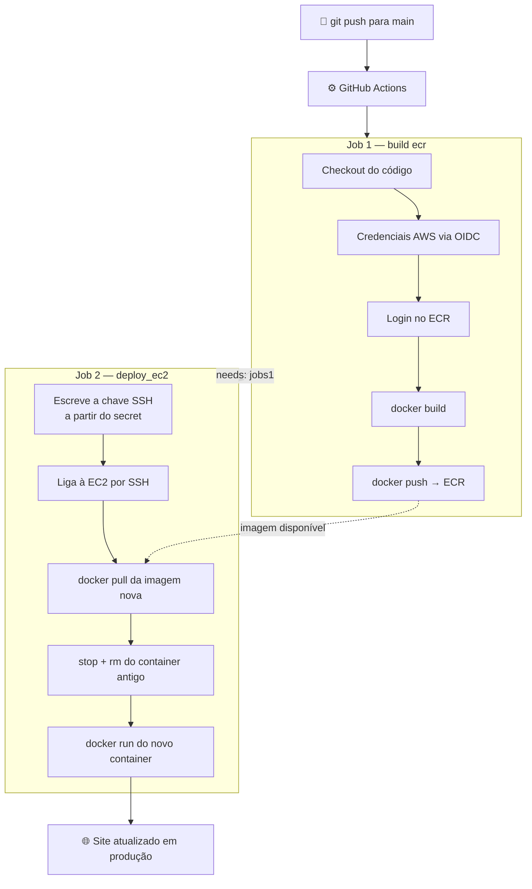

# 🔄 Pipeline CI/CD Completa — Build, Push e Deploy Automático

Pipeline final do projeto: a cada `push` (ou `pull request`) para a branch `main`, o GitHub Actions constrói a imagem Docker do site, envia-a para o **Amazon ECR**, e faz o **deploy automático** na instância EC2 via SSH — sem qualquer passo manual.

## 📌 Índice

1. [O que esta fase resolve](#-o-que-esta-fase-resolve)
2. [Arquitetura do pipeline](#️-arquitetura-do-pipeline)
3. [Pré-requisitos](#-pré-requisitos)
4. [O workflow, bloco a bloco](#-o-workflow-bloco-a-bloco)
5. [O script de arranque da EC2 (`user_data.sh`)](#-o-script-de-arranque-da-ec2-user_datash)
6. [Secrets necessários](#-secrets-necessários)
7. [Problemas conhecidos e por resolver](#-problemas-conhecidos-e-por-resolver)
8. [Segurança — pontos de atenção](#-segurança--pontos-de-atenção)
9. [Próximos passos](#-próximos-passos)

---

## 🎯 O que esta fase resolve

Nas fases anteriores, o fluxo era:
1. Construir a imagem Docker **manualmente**
2. Fazer `docker push` para o ECR **manualmente**
3. Ligar por SSH à EC2 **manualmente**
4. Fazer `docker pull` + `docker run` **manualmente**

Esta fase junta tudo num único workflow, acionado automaticamente a cada alteração ao código: **push → build → push para ECR → deploy na EC2**, sem intervenção humana.

---

## 🏛️ Arquitetura do pipeline



**A ideia central:** o Job 2 só começa depois do Job 1 terminar com sucesso (`needs: jobs1`), garantindo que a imagem já está no ECR antes de a EC2 tentar fazer o pull.

---

## 🔧 Pré-requisitos

| Item | Detalhe |
|---|---|
| IAM Identity Provider OIDC | `token.actions.githubusercontent.com`, já configurado nas fases anteriores |
| IAM Role `GitHubAccessRole` | Com permissões de ECR (push de imagens) e trust policy que aceita o token do repositório |
| Repositório ECR `site_prod` | Criado na região `eu-north-1` |
| Instância EC2 | Com Docker instalado (via `user_data.sh` no arranque) e IAM Role com acesso de leitura ao ECR |
| Par de chaves SSH | Chave pública associada à EC2; chave privada guardada como **GitHub Secret** |
| Security Group | Porta 22 (SSH) e porta 80 (HTTP) abertas, conforme necessário para o runner conseguir ligar |

---

## 📄 O workflow, bloco a bloco

### Trigger e permissões

```yaml
on:
  push:
    branches:
      - main
  pull_request:
    branches:
      - main

permissions:
  contents: read
  id-token: write
```

| Elemento | O que faz |
|---|---|
| `push` para `main` | O pipeline corre automaticamente sempre que há um commit nesta branch |
| `pull_request` para `main` | O pipeline corre também ao abrir/atualizar um PR contra `main` — útil para validar que o build funciona **antes** de fazer merge |
| `id-token: write` | Permissão necessária para o OIDC — sem ela, o passo de autenticação AWS falha |

> ⚠️ Nota: num `pull_request` vindo de um **fork** (não do próprio repositório), o GitHub restringe tokens OIDC por segurança — o pipeline pode falhar nesse cenário específico. Para PRs internos (mesma conta/organização), funciona normalmente.

---

### Job 1 — `build_ecr`

```yaml
jobs:
  jobs1:
    name: build ecr
    runs-on: ubuntu-latest
    env: 
      ACCOUNT_ID: ${{ secrets.ACCOUNT_ID }}
    steps:
      - name: Checkout code
        uses: actions/checkout@v4

      - name: Setup AWS Credentials
        uses: aws-actions/configure-aws-credentials@v4
        with:
          role-to-assume: arn:aws:iam::${ACCOUNT_ID}:role/GitHubAccessRole
          aws-region: eu-north-1
          role-skip-session-tagging: true

      - name: Login to Amazon ECR
        uses: aws-actions/amazon-ecr-login@v2

      - name: Build, tag, and push image to Amazon ECR
        working-directory: app
        run: |
          docker build -t meu-website:v1.0 .
          docker tag meu-website:v1.0 ${ACCOUNT_ID}.dkr.ecr.eu-north-1.amazonaws.com/site_prod:v1.0
          docker push ${ACCOUNT_ID}.dkr.ecr.eu-north-1.amazonaws.com/site_prod:v1.0
```

| Step | O que faz |
|---|---|
| `Checkout code` | Copia o repositório para o runner — sem isto não há `Dockerfile` nem código para construir |
| `Setup AWS Credentials` | Troca o token OIDC do GitHub por credenciais AWS temporárias, assumindo a `GitHubAccessRole` |
| `Login to Amazon ECR` | A action oficial da AWS que autentica o Docker local (do runner) no registo ECR, usando as credenciais já obtidas — substitui o `docker login` manual |
| `Build, tag, and push` | Constrói a imagem a partir do `Dockerfile` na pasta `app/` (`working-directory`), etiqueta-a com o URI completo do ECR, e envia-a |

> 💡 `ACCOUNT_ID` é definido como variável de ambiente do **job** (`env:` ao nível do job), para não repetir `${{ secrets.ACCOUNT_ID }}` em cada linha — uma boa prática de legibilidade.

---

### Job 2 — `deploy_ec2`

```yaml
  job2:
    name: deploy_ec2
    needs: jobs1
    env:
      EC2_KEY_PRIVADA: ${{ secrets.EC2_KEY_PRIVADA }}
      ACCOUNT_ID: ${{ secrets.ACCOUNT_ID }}
    runs-on: ubuntu-latest
    steps:
      - name: ssh ec2
        run: |
          echo "$EC2_KEY_PRIVADA" > chave-site
          chmod 400 chave-site
          ssh -i chave-site -o StrictHostKeyChecking=no ec2-user@51.21.168.25 << EOF
            aws ecr get-login-password --region eu-north-1 | docker login --username AWS --password-stdin ${ACCOUNT_ID}.dkr.ecr.eu-north-1.amazonaws.com
            echo "Pull da nova imagem do ECR"
            docker pull ${ACCOUNT_ID}.dkr.ecr.eu-north-1.amazonaws.com/site_prod:v1.0
            echo "stop contaner antigo"
            docker stop site || true
            echo "remover contaner antigo"
            docker rm site || true
            echo "iniciando um novo contaner"
            docker run -d -p 80:80 --name site ${ACCOUNT_ID}.dkr.ecr.eu-north-1.amazonaws.com/site_prod:v1.0
            docker ps -a
          EOF
          rm -f chave-site.pem
```

| Linha | O que faz |
|---|---|
| `needs: jobs1` | O Job 2 só arranca depois do Job 1 (`jobs1`) terminar **com sucesso** — se o build falhar, o deploy nem chega a correr |
| `echo "$EC2_KEY_PRIVADA" > chave-site` | Escreve a chave SSH privada (guardada como secret) num ficheiro temporário, dentro do runner |
| `chmod 400 chave-site` | Restringe as permissões do ficheiro, como o SSH exige para aceitar a chave |
| `ssh -i chave-site -o StrictHostKeyChecking=no ec2-user@...` | Liga à EC2 usando a chave. `StrictHostKeyChecking=no` evita que o SSH pare à espera de confirmação manual do *fingerprint* — necessário em automação, onde não há ninguém para responder `yes` |
| `<< EOF ... EOF` (heredoc) | Tudo o que está entre os dois `EOF` é enviado como um **único bloco de comandos**, executado remotamente dentro da EC2, numa única sessão SSH |
| `docker login` (dentro do heredoc) | Corre **na EC2**, usando a IAM Role já associada à instância — não precisa de credenciais adicionais |
| `docker stop site \|\| true` / `docker rm site \|\| true` | O `\|\| true` evita que o script pare com erro se o container `site` ainda não existir (ex.: no primeiro deploy) |
| `docker run -d -p 80:80 --name site ...` | Lança o novo container, mapeando a porta 80 |
| `rm -f chave-site.pem` | Limpa a chave do runner no fim — nota: há uma pequena inconsistência de nome aqui (ver secção de problemas conhecidos) |

---

## 🖥️ O script de arranque da EC2 (`user_data.sh`)

```bash
#!/bin/bash
sudo su
yum update -y
yum install -y docker
service docker start
usermod -a -G docker ec2-user
```

Este script corre **automaticamente** na primeira vez que a instância EC2 arranca (passado via `user_data` no Terraform), e prepara a máquina para já ter o Docker pronto a usar, sem passos manuais.

| Linha | O que faz |
|---|---|
| `#!/bin/bash` | Shebang — diz ao sistema para interpretar o ficheiro como um script Bash |
| `yum update -y` | Atualiza os pacotes do sistema |
| `yum install -y docker` | Instala o Docker |
| `service docker start` | Inicia o serviço Docker |
| `usermod -a -G docker ec2-user` | Adiciona o utilizador `ec2-user` ao grupo `docker`, para poder correr comandos Docker sem `sudo` |


---

## 🔑 Secrets necessários

Configurados em **Settings → Secrets and variables → Actions**:

| Secret | Conteúdo |
|---|---|
| `ACCOUNT_ID` | O Account ID da conta AWS |
| `EC2_KEY_PRIVADA` | Conteúdo completo da chave **privada** SSH (`-----BEGIN...` até `-----END...`) |

> 🔒 A `GitHubAccessRole` para o ECR continua a usar **OIDC** (sem secrets de access key). O único secret realmente sensível aqui é a chave SSH privada, necessária porque o deploy usa SSH direto em vez de um mecanismo totalmente integrado com IAM (ver [Próximos passos](#-próximos-passos)).


---

## 🔒 Segurança — pontos de atenção

| Ponto | Situação atual | Recomendação |
|---|---|---|
| Autenticação com a AWS (Job 1) | OIDC, sem credenciais fixas | ✅ Já segue a boa prática |
| Autenticação com a EC2 (Job 2) | Chave SSH privada como secret | ⚠️ Funcional, mas obriga a manter a porta 22 acessível ao runner |
| Acesso SSH à EC2 | Depende do security group aceitar o IP (dinâmico) do runner do GitHub | Considerar substituir SSH por **AWS Systems Manager (SSM) Session Manager** — elimina a necessidade de abrir a porta 22 e de gerir uma chave como secret, usando a IAM Role que a EC2 já tem |
| `StrictHostKeyChecking=no` | Desativa a verificação do *fingerprint* do servidor | Aceitável em automação controlada (sabes qual é a EC2 de destino), mas em ambientes mais sensíveis pode-se fixar o `known_hosts` antecipadamente |
| Imagem sempre com a tag `v1.0` | Cada novo build **sobrescreve** a mesma tag | Sem versionamento, não há como fazer rollback para uma versão anterior específica — ver próximos passos |

---

## 🚀 Próximos passos

- [ ] Obter o IP da EC2 dinamicamente, em vez de o fixar no workflow
- [ ] Etiquetar cada imagem com o **SHA do commit** (ex.: `site_prod:a2f8eca`), em vez de reutilizar sempre `v1.0` — permite fazer rollback para uma versão específica
- [ ] Migrar o deploy de SSH para **AWS SSM Session Manager**, removendo a necessidade da chave SSH como secret e de manter a porta 22 aberta
